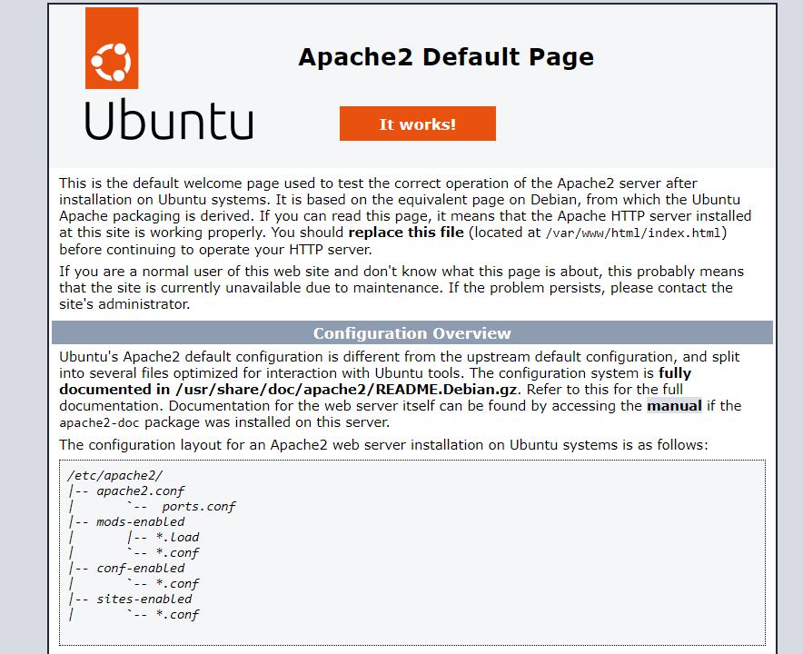

# How to deploy your own web server

### Prerequisites

- Have an Ubuntu server (with sudo access)
  - Can be purchased from a provider (e.g., OVH, Amazon, Azure)
  - Can be done with an old PC at home
- Have a domain name

## Steps to follow

1. Initial Setup and Installation
   1. Install Apache
   2. Customize your website
2. Secure Your Server
   1. Set up UFW
   2. Enable HTTPS

### Inital setup

First, connect to your server via the command line. I recommend using SSH.

#### Apache installation
> Apache is the software that allows you to host a website.

Install Apache
```bash
sudo apt install apache2
```

In a web browser, enter your server's IP address. You should see a page like this :


##### Customize Your Website
> The default website location is `/var/www/html/`

You can now import your website in the `/var/www/` directory.
For example, importing from GitHub:
```bash
cd /var/www
git clone git@github.com:MyUsername/MyRepo.git
```
###### Update the Directory

Edit the config file for your website directory
```bash
sudo nano /etc/apache2/sites-available/000-default.conf
```

Locate the line `DocumentRoot /var/www/html`, and update the directory. (e.g., `/var/www/my-website-dir`)

Reload Apache
```
sudo systemctl reload apache2
```

In a browser, confirm that your website is working


#### Configure a Domain Name for Your Website

1. Purchase a domain name (e.g., from Namecheap)
2. On your domain name provider's website:
   1. Manage your domain name
   2. Link your domain to your server's IP address
   3. Enter your domain in a web browser to confirm your website is accessible

---
## Securing your server

#### UFW firewall
> A firewall to block unused ports.

Install UFW
```bash
sudo apt install ufw
```

Allow essential ports
```bash
sudo ufw allow 80/tcp  # HTTP
sudo ufw allow 443/tcp # HTTPS
sudo ufw allow 22/tcp  # SSH
```

Activate the firewall and reboot the server
```bash
sudo ufw enable
reboot
```

#### HTTPS
> Provides encrypted connections to your website

We'll use Certbot to generate an SSL certificate.

Install Certbot
```bash
sudo apt install certbot python3-certbot-apache
```

###### Generate the SSL Certificate
Run Certbot
```bash
sudo certbot --apache
```

Answer the prompts
1. Provide your email address
2. Accept the terms of service
3. Choose whether to share your email address
   
Check for success, then reload your website. Your URL should now look like this: `https://mywebsite.com` 